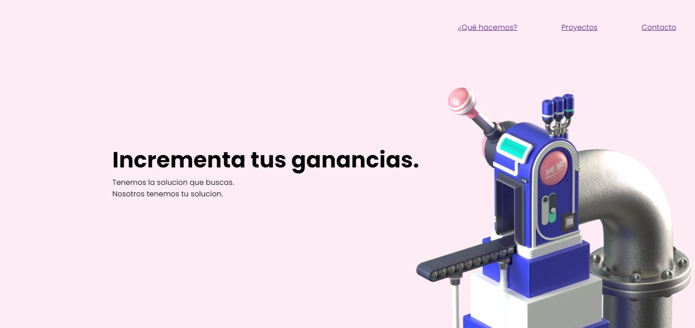

# Este es mi repositorio

## Tabla de contenidos

- [Descripción](#Descripción)
- [Tecnologías](#Tecnologías-que-usamos)
- [Autores](#Autores)
- [Requisitos](#Requisitos)
- [Uso](#uso)
- [Capturas](#capturas)

## Descripción
Este proyecto es una pagina web muy sencilla.

Esta empresa a la que le estamos haciendo la pagina es muy profesional y son buenas personas y tienen lindas mascotas.

Tecnologías que usamos

## Tecnologías que usamos

- Webpack
- Nodejs
- CSS3
- HTML5
- Mermelada

## Autores

Nombre | Contacto | Emoji
-- | -- | --
Usiel | [github](https://github.com/usielarb) | :tada:
Pepe | github | :open_mouth:

## Requisitos

- Nodejs v15.9.0
- Un navegador
- Muchas ganas

## Uso

Clonar el reposipositorio
```bash
git clone https://jndfkjhsdf
```

Descargamos paquetes de node
```bash
npm install
```

Ejecutamos el servidor de `webpack`
```bash
npm start
```

## Capturas



## Mas documentacion

- [Informacion importante](./docs/importante.md)
- [Informacion importante pero a un subtitulo](./docs/importante.md#esto-es-un-subtitulo)